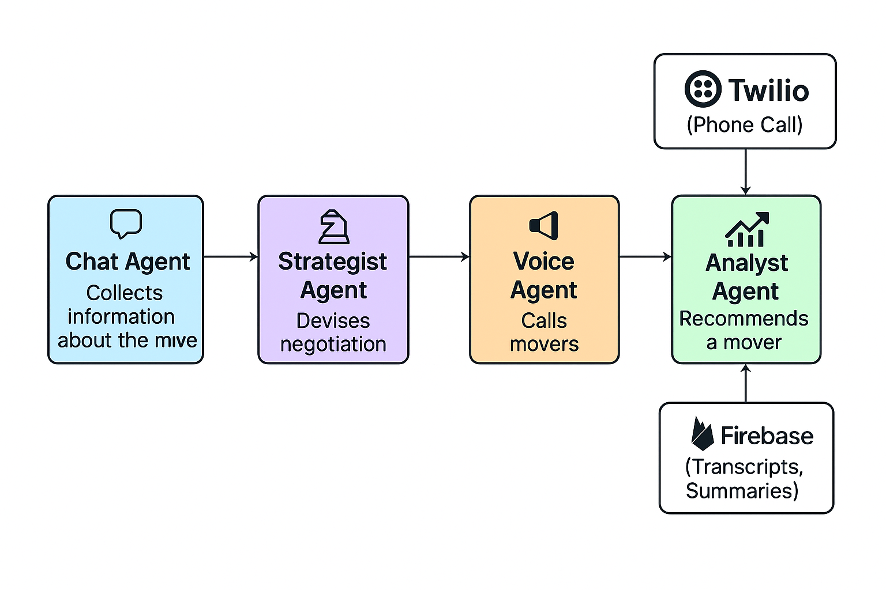

# 🧠 Real-Time Multi-Agent Voice AI System

Moving to a new home often means calling multiple moving companies, explaining your requirements, and negotiating quotes — a process that’s **time-consuming, repetitive, and inefficient**. 

The **AI Negotiation Agent** automates this by acting as a virtual assistant that **calls or interacts with multiple moving service providers**, negotiates prices, and summarizes outcomes. It intelligently updates its negotiation strategy after each call, learning what works best to help users find the most cost-effective and reliable option — **saving hours of manual effort** while maintaining a professional, consistent approach across all providers.

---

## 🚀 Features

- 🎙️ **Real-Time Streaming** — Bidirectional audio handled via WebSockets with sub-500 ms latency.  
- 🤖 **Multi-Agent Orchestration** — Modular design allows multiple AI agents (e.g., chat agent, voice agent) to cooperate in dialogue.  
- ☁️ **LLM-Powered Reasoning** — Integrates streaming LLMs for dynamic, contextual responses.  
- ☎️ **Twilio Voice Integration** — Seamlessly connects phone calls to your AI agents.  
- 🧩 **Server-Client Architecture** — Built with **FastAPI** and **Uvicorn**, supporting scalable asynchronous I/O.  
- 🔊 **Speech ↔ Text Conversion** — Uses Whisper for transcription and real-time voice synthesis for responses.  
- 🧱 **Modular & Extensible** — Easily plug in different LLMs, voice models, or downstream reasoning agents.  

---
## 🧭 Multi-Agent Graph



---

## 🏗️ System Architecture

```
 ┌──────────────┐      HTTP POST       ┌────────────────────┐
 │ Twilio Voice │ ───────────────────▶ │ FastAPI Server     │
 │  (Phone Call)│                      │  /outgoing-call    │
 └──────────────┘                      └────────────────────┘
        │                                      │
        ▼                                      ▼
  WebSocket Media Stream           ↔      WebSocket LLM Stream
 (Audio in/out via Twilio)                  (Text/Audio from OpenAI)
        │                                      │
        ▼                                      ▼
  Whisper ASR  ───────▶  Streaming LLM  ───────▶  TTS Audio Output
```

---

## ⚙️ Tech Stack


---

## 🧩 Folder Structure

```
AI-negotiation-agent/
├── voice_server.py         # Main FastAPI app handling Twilio + WS
├── test_ws_connect.py      # WebSocket connectivity test script
├── requirements.txt
├── README.md
└── agents/
    ├── chat_agent.py       # Multiple agents
    └── ....
```

---

## 🧪 Local Development

### 1. Clone and install dependencies
```bash
git clone https://github.com/yourusername/AI-negotiation-agent.git
cd AI-negotiation-agent
python -m venv vagents
source vagents/bin/activate
pip install -r requirements.txt
```

### 2. Run the FastAPI server
```bash
python -m uvicorn voice_server:app --reload
```

The server will start at:
```
http://127.0.0.1:8000
```

### 3. Expose the server publicly with ngrok
Configure ngrok with your credentials and start ngrok in a new terminal:
```bash
ngrok http 8000
```
Copy the generated public URL from the ngrok terminal output.
Add it to your .env file under:
```
SERVER_ENDPOINT=<your_ngrok_public_url>
```
Store all API keys securely in .env file.


### 4. Test WebSocket connection
```bash
python test_ws_connect.py
```
If you see `Connected ok`, your agent server is ready to handle Twilio streams.

---

## ☁️ Deployment

- **Dockerize** the FastAPI app for reproducibility.
- Deploy on **AWS EC2**, **Render**, or **Google Cloud Run** with a public HTTPS endpoint.
- Update your **Twilio Voice Webhook URL** to point to:
  ```
  https://your-domain.com/outgoing-call-twiml
  ```

---

## 📞 Example Use Case

This system can power:
- Autonomous **customer service agents**  
- **Scheduling assistants** that converse naturally  
- **Information hotlines** for businesses or nonprofits  
- Multi-agent **dialogue systems** (agent-to-agent collaboration)  

---

## 🧠 Future Enhancements

- 🔁 Add memory & context chaining between turns  
- 🧩 Integrate retrieval (RAG) for domain-specific knowledge  
- 💬 Enable multi-language voice support  
- 🕵️ Add emotion detection & dynamic response modulation  

---


